# Arsitektur Sistem — MCF Photobooth v1.1

Dokumen ini menggambarkan sistem secara utuh: perangkat keras di venue, komponen perangkat
lunak, alur data, dan yang paling penting, **apa yang dialami operator** dan **apa yang
dilihat tamu** dari detik ke detik. Semua isinya ditulis dari kode yang berjalan hari ini
(`app/`, `web/`), bukan dari rencana.

Hubungan dengan dokumen lain:

| Dokumen | Isi | Kalau berselisih |
|---|---|---|
| `prd-sistem-photobooth.md` | lingkup, user story, requirement | PRD menang soal *apa* yang dibangun |
| `design.md` | prinsip tampilan, tiap layar, keadaan galat | design.md menang soal *bagaimana tampilannya* |
| **`architecture.md` (ini)** | gambaran sistem + alur operator + alur tamu | — |
| `README.md` | instalasi, panduan operator, pemecahan masalah | README menang soal *cara memakainya* |

---

## 1. Gambaran besar

Satu kalimat: **operator memotret, foto naik ke Google Drive sendiri, tamu memindai QR di
monitor sebelah dan mengunduh fotonya dari HP mereka.**

Tiga pihak yang terlibat, dan mereka tidak pernah berbagi perangkat:

- **Operator** memegang laptop Windows. Di laptop itu hidup satu server Python lokal dan
  satu browser dengan dua jendela: panel operator dan layar tamu.
- **Tamu** berdiri di depan booth, melihat monitor kedua (1080 × 1920 portrait), lalu
  memindai QR dengan HP-nya sendiri. HP tamu berbicara langsung ke Google Drive, tidak
  pernah ke laptop operator.
- **Google Drive** adalah tempat penyimpanan sekaligus jalur distribusi. Satu folder per
  tamu, izin *anyone with link — viewer*.

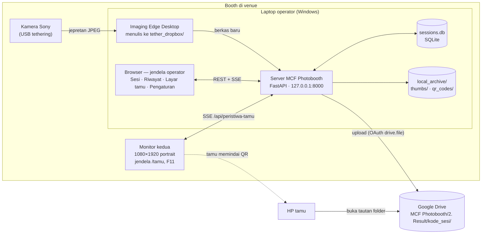

Yang sengaja **tidak** ada di gambar: koneksi dari internet ke laptop. Server hanya
mengikat ke `127.0.0.1`, jadi satu-satunya lalu lintas keluar adalah laptop → Google.

---

## 2. Perangkat keras dan tata letak di venue

| Perangkat | Peran | Catatan |
|---|---|---|
| Kamera Sony (ZV-E10 atau bodi lain yang didukung Imaging Edge Remote) | memotret | setelan JPEG, auto power-off mati, baterai dummy untuk acara panjang |
| Kabel USB kamera → laptop | jalur tethering | Wifi bawaan kamera tidak dipakai, terlalu lambat dan gampang putus |
| Laptop Windows | menjalankan Imaging Edge Desktop, server, dan browser | Python 3.11+, tidak perlu port terbuka |
| Monitor kedua 1920 × 1080, diputar portrait | layar tamu | dihubungkan HDMI, diatur *Portrait* di pengaturan tampilan Windows, menghadap tamu |
| Wifi venue | upload ke Drive | boleh putus-nyambung, sistem menyusulkan upload begitu tersambung |
| HP tamu | memindai QR, mengunduh dari Drive | butuh internet HP sendiri; tidak ada aplikasi yang harus dipasang |

Tata letak yang diasumsikan desain: operator menghadap laptop, monitor kedua ada di
samping atau belakang operator menghadap tamu. Karena operator **tidak bisa melihat**
monitor tamu secara langsung, panel operator selalu memuat cuplikan hidup dari halaman
tamu (§8).

---

## 3. Komponen perangkat lunak

Satu proses Python, satu berkas database, satu folder web statis. Keempat komponen inti
bertukar keadaan lewat SQLite, bukan lewat variabel di memori, supaya restart di tengah
acara tidak menghilangkan apa pun.

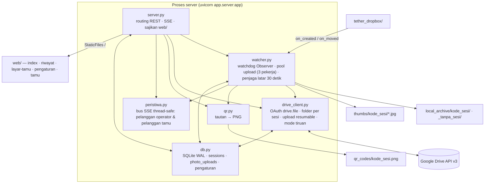

### 3.1 Peran tiap modul

| Modul | Tanggung jawab | Yang sengaja tidak dilakukannya |
|---|---|---|
| `server.py` | Semua endpoint REST, dua aliran SSE, menyajikan `web/`, menolak POST lintas situs, menyusun keadaan layar tamu (`/api/tampilan-tamu`), pemeriksaan awal | Tidak menyimpan keadaan sesi di memori; setiap jawaban dibaca ulang dari DB |
| `watcher.py` | Mendeteksi berkas foto baru, menunggu berkas selesai ditulis, memutuskan sesi tujuan, menyalin ke arsip, membuat thumbnail, mencatat ke DB, mengantre upload dengan retry, penjaga latar, pemulihan saat server naik | Tidak pernah menghapus berkas apa pun, di `tether_dropbox/` maupun di arsip |
| `drive_client.py` | Kredensial dan refresh token dengan batas waktu, login OAuth di thread latar, struktur folder induk, folder sesi + izin, upload, cek duplikat sebelum upload ulang, status dan kuota, mode tiruan untuk uji | Tidak pernah membuka browser di tengah request; tidak melakukan retry (itu urusan watcher) |
| `qr.py` | Satu tautan masuk, satu PNG keluar (error correction H, hitam di atas putih) | Tidak tahu apa isi tautannya; mengganti Drive dengan galeri kustom tidak menyentuh modul ini |
| `peristiwa.py` | Antrean per pelanggan SSE, dua kelompok (operator dan tamu), pengiriman aman dari thread mana pun lewat `call_soon_threadsafe`, pelanggan macet dibuang pesannya yang terlama | Tidak menyimpan riwayat peristiwa; pelanggan baru mendapat keadaan lengkap lewat pesan `halo` |
| `db.py` | Skema, kode sesi unik, satu sesi aktif pada satu waktu (`BEGIN IMMEDIATE`), hitungan foto yang selalu dihitung ulang dari `photo_uploads`, pencarian nama yang peka huruf non-ASCII | Tidak tahu apa-apa soal HTTP; galat diterjemahkan `server.py` jadi kode status |
| `jalur.py` | Semua path dari `.env` diselesaikan relatif terhadap akar repo | — |
| `web/app.js` | Satu berkas untuk lima halaman; tiap halaman mengaktifkan bagiannya sendiri berdasarkan atribut di DOM | Tidak ada framework, tidak ada permintaan ke CDN; font di-bundle lokal |

### 3.2 Thread di dalam proses

Ini penting untuk memahami kenapa ada kunci di mana-mana:

| Thread | Sumber | Yang dikerjakan |
|---|---|---|
| Event loop asyncio | uvicorn | handler HTTP (sinkron, dijalankan di threadpool Starlette) dan generator SSE |
| Observer watchdog | `watcher.mulai()` | menerima peristiwa filesystem, melempar tiap berkas ke thread `foto-<nama>` sendiri |
| `foto-<nama>` | per berkas | tunggu stabil → salin → thumbnail → catat → antrekan upload |
| Pool `upload-*` (3 pekerja) | `UPLOAD_PARALEL` | `pasang_drive` (dikunci per sesi) lalu `_upload_dengan_retry` |
| `penjaga` | tiap 30 detik | sapu berkas tether yang terlewat, ulang upload yang gagal/menggantung, pasang folder ke sesi yang belum punya |
| `drive-login` | tombol Login Google | `InstalledAppFlow.run_local_server`, batas waktu 240 detik |

---

## 4. Alur data end-to-end: satu tamu

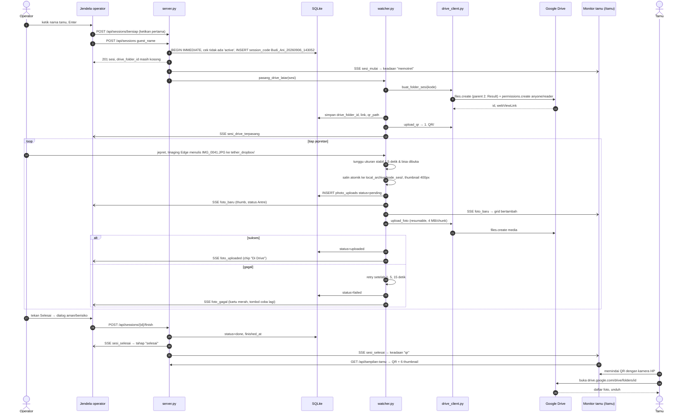

Dua hal yang membuat alur ini tahan banting:

- **Mulai Sesi kembali seketika.** Folder Drive dan QR dibuat di latar. Wifi venue yang
  lambat tidak membuat tombol menggantung, dan operator sudah boleh memotret sebelum
  foldernya ada. Foto yang mendarat sebelum folder terpasang menunggu sebagai `pending`
  dan diantrekan begitu `pasang_drive` selesai.
- **QR dibuat saat sesi dimulai, ditampilkan saat sesi diakhiri.** Tautannya sudah ada di
  DB sejak awal, jadi QR bisa dibuat ulang kapan saja, termasuk berbulan-bulan kemudian
  dari Riwayat, tanpa mengupload apa pun.

---

## 5. Siklus hidup: sesi, foto, layar tamu

### 5.1 Sesi

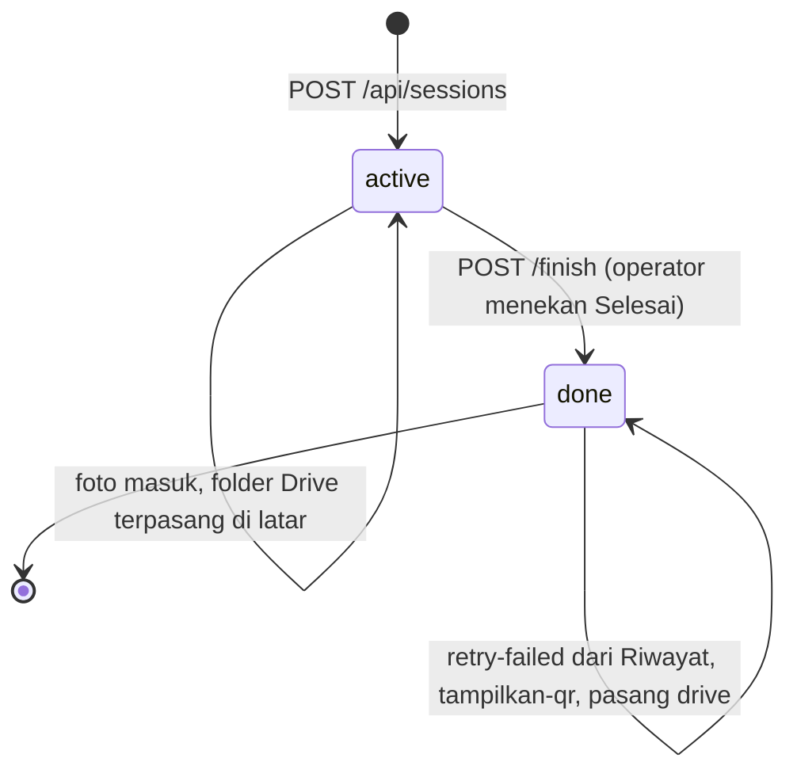

Aturan yang dijaga DB, bukan tampilan:

- Hanya **satu** sesi `active` pada satu waktu. Permintaan kedua ditolak 409 dengan sesi
  yang menghalangi, supaya tampilan bisa menawarkan lanjutkan atau akhiri.
- Aplikasi **tidak pernah** mengakhiri sesi sendiri. Tidak ada auto-detect selesai.
- `session_code` = slug nama + timestamp presisi detik; tabrakan di detik yang sama diberi
  akhiran `_2`, bukan ditolak. Kode ini sekaligus nama folder di arsip lokal dan di Drive.
- Sesi `done` tetap bisa diperbaiki: pasang folder Drive, upload sisa, tampilkan QR ulang.

### 5.2 Foto

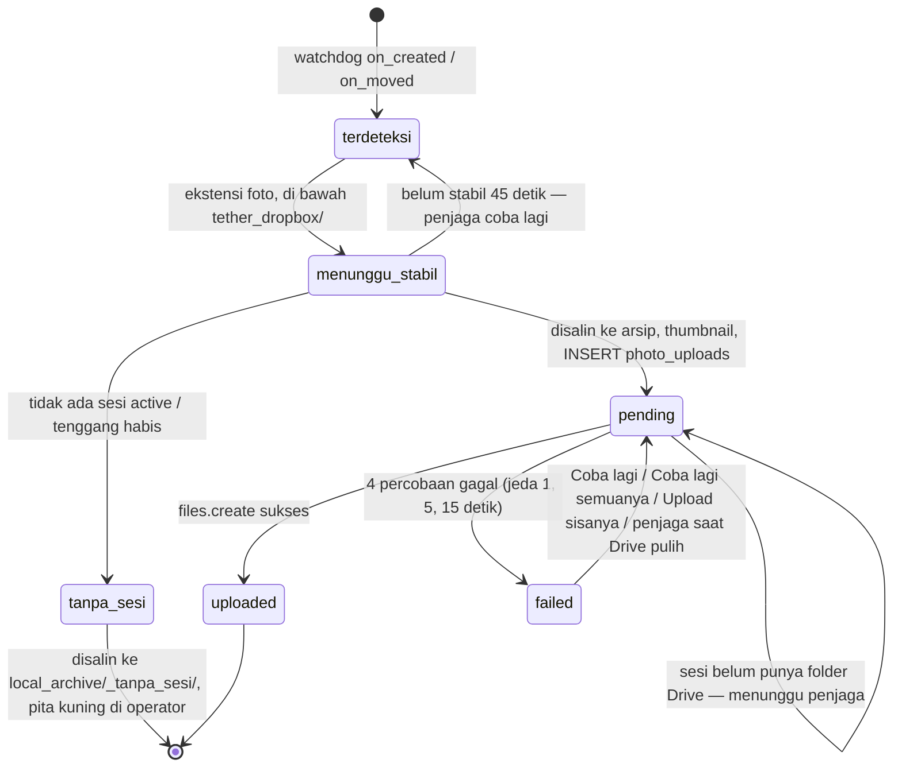

Dedupe di tiga titik: laporan ganda watchdog untuk berkas yang sama dilewati (ukuran
sama), nama sama tapi isi beda diberi akhiran `_2`, dan setiap upload ulang mencari dulu
berkas bernama sama di folder Drive supaya respons yang hilang di jaringan tidak
menghasilkan duplikat.

### 5.3 Layar tamu

Keadaan monitor tamu **dihitung server** di `GET /api/tampilan-tamu`, dengan urutan
prioritas ini:

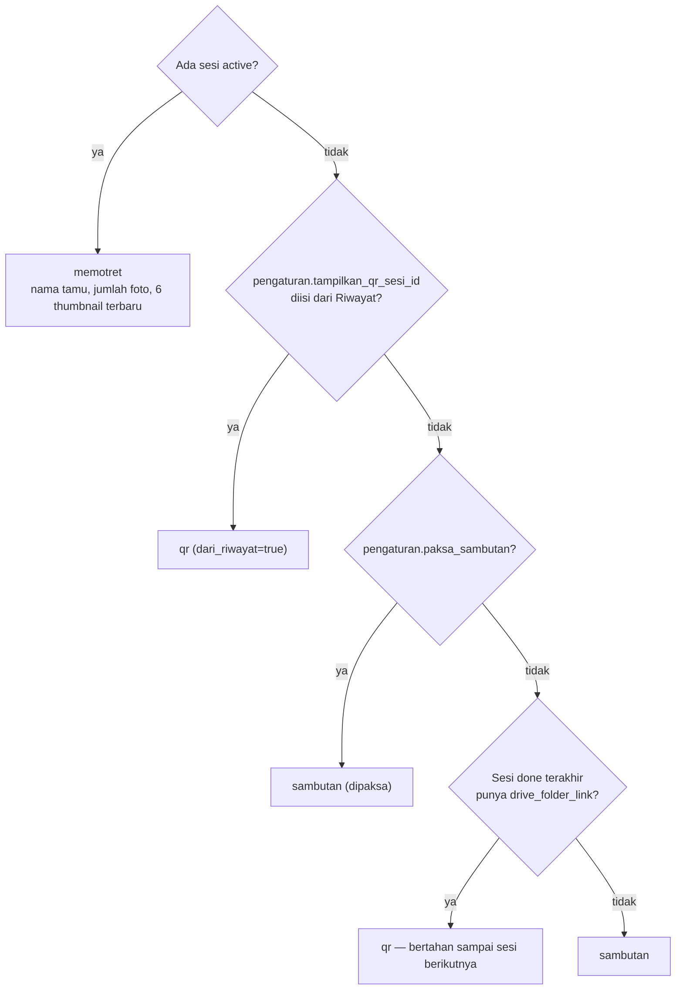

Jendela tamu tidak menyimpan keadaan sendiri. Setiap peristiwa SSE apa pun yang masuk
membuatnya memanggil ulang `/api/tampilan-tamu` (di-debounce 120 ms), jadi jendela yang
ditutup dan dibuka lagi di tengah acara langsung benar.

---

## 6. User flow operator

Operator berinteraksi lewat satu jendela browser bersidebar empat tujuan: **Sesi**,
**Riwayat**, **Layar tamu**, **Pengaturan**. Kaki sidebar selalu menampilkan empat baris
kesehatan (Drive dan kuota, internet, disk lokal, layar tamu), diperbarui tiap 15 detik dan
tiap ada peristiwa sesi.

### 6.1 Persiapan sekali seumur laptop

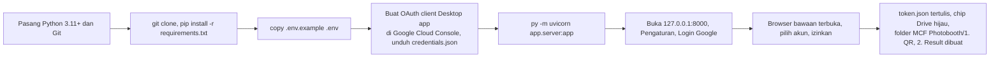

Yang dilihat operator di halaman Pengaturan setelah langkah ini: alamat email akun, kuota
terpakai dengan meter, struktur folder Drive yang berlaku, path folder tethering/arsip/
thumbnail/QR/database, kebijakan retry (1, 5, 15 detik), tenggang setelah Selesai (45
detik), ambang berkas stabil (1,5 detik), izin folder Viewer, dan status layar tamu.
Nilainya hanya bisa dibaca; mengubah folder berarti mengedit `.env` dan menyalakan ulang
server.

### 6.2 Sebelum acara, di rumah

1. Buka aplikasi. Kalau consent screen Google masih berstatus *Testing*, login ulang
   paling lambat malam sebelum acara (refresh token mati setelah 7 hari).
2. Sambungkan kamera, buka Imaging Edge Remote, arahkan folder simpannya ke path yang
   tertulis di Pengaturan → Folder tethering.
3. Jepret sekali. Foto akan berakhir di `local_archive/_tanpa_sesi/` karena belum ada
   sesi, dan pita kuning "1 foto masuk saat tidak ada sesi" muncul di halaman Sesi.
   **Itu normal**, artinya jalur tethering hidup. Tekan "Mengerti, sembunyikan".
4. Lihat panel **Sebelum mulai** di halaman Sesi: enam baris harus hijau.

| Pemeriksaan | Hijau | Kuning (boleh lanjut) | Merah (Mulai Sesi dimatikan) |
|---|---|---|---|
| Google Drive terhubung | "terhubung sebagai …" | — | belum login, credentials.json tidak ada, token ditolak |
| Kuota Drive | sisa ≥ 5 GB | sisa < 5 GB, ditulis kira-kira muat berapa foto | — |
| Folder tethering terpantau | path folder | ada berkas baru yang belum masuk sesi mana pun | pemantau tidak berjalan |
| Koneksi internet | tersambung ke Google | — | putus, tapi ini **tidak** menghalangi Mulai Sesi (jadi peringatan kuning di bawah tombol) |
| Ruang disk lokal | bebas ≥ 20 GB | bebas < 20 GB | — |
| Layar tamu | terbuka, menampilkan … | belum dibuka, QR bisa ditampilkan di laptop | — |

Selain itu, sesi lain yang masih `active` juga mematikan tombol dengan alasan tertulis.

### 6.3 Di venue: memasang monitor kedua

1. Colok monitor, di pengaturan tampilan Windows putar ke **Portrait**.
2. Buka halaman **Layar tamu**, tekan **Buka jendela layar tamu**. Jendela baru 540 × 960
   terbuka memuat `/tamu`.
3. Seret jendela itu ke monitor kedua, tekan **F11**.
4. Chip "Layar tamu terhubung" di bilah atas menyala hijau. Chip ini digerakkan oleh
   koneksi SSE `/api/peristiwa-tamu` yang hidup, bukan oleh deteksi monitor, jadi ia
   jujur: monitor terpasang tapi jendela tertutup tetap terbaca "belum dibuka".
5. Cuplikan hidup di halaman Layar tamu menampilkan persis apa yang tamu lihat. Ia
   memuat `/tamu?cermin=1`, yang sengaja berlangganan aliran operator supaya tidak
   dihitung sebagai jendela tamu.

Kalau monitor kedua tidak ada: tombol **Tampilkan di laptop ini** membuka `/tamu?laptop=1`
di tab baru untuk di-F11 dan diputar menghadap tamu. Jalan keluarnya tekan-tahan pojok
kanan bawah dua detik, atau Esc.

### 6.4 Per tamu: tiga aksi

Ini inti sistem dan berlangsung seluruhnya di halaman **Sesi**, yang punya tiga tahap
dalam satu halaman: **idle → aktif → selesai**.

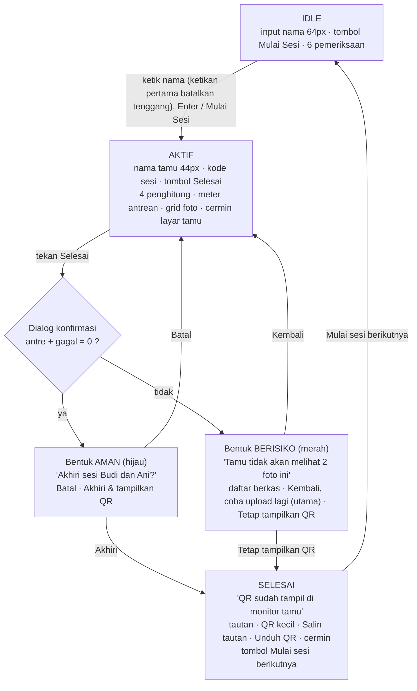

**Aksi 1 — Ketik nama, Mulai Sesi.**
Saat mengetik, keterangan di bawah input memberi tahu kalau nama yang sama sudah dipakai
hari ini ("2 sesi hari ini sudah memakai nama ini, tambahkan nomor meja"). Ketikan
pertama juga mengirim `POST /api/sessions/bersiap` yang membatalkan tenggang 45 detik sesi
sebelumnya, supaya jepretan uji untuk tamu baru tidak masuk ke folder tamu lama yang
QR-nya sedang dipindai. Enter atau klik tombol mengirim `POST /api/sessions`. Halaman
langsung pindah ke tahap aktif; monitor tamu berganti ke "memotret" pada saat yang sama.

**Aksi 2 — Motret seperti biasa.**
Yang dilihat operator selama tahap aktif:

| Elemen | Isi | Warna / arti |
|---|---|---|
| Kepala | nama tamu 44px, kode sesi mono, "Sesi aktif · berjalan N menit", tombol Selesai | Selesai berwarna aksen, bukan merah, ia jalur normal |
| Penghitung 1: **foto terakhir masuk** | "12 detik sejak foto terakhir" + nama berkas | < 90 detik "Mengalir" hijau; 90–180 "Periksa kamera" kuning; ≥ 180 "Tethering putus?" merah |
| Penghitung 2: **Sudah di Drive** | jumlah `uploaded` | hijau |
| Penghitung 3: **Sedang diupload** | jumlah `pending` | kuning |
| Penghitung 4: **Gagal** | jumlah `failed` | nol: abu-abu "Tidak ada"; ≥ 1: kartu berubah merah, chip "Perlu tindakan", pita merah dengan daftar nama berkas dan tombol **Coba lagi semuanya** |
| Meter antrean | proporsi hijau/kuning/merah dan rasio "9 / 12" | — |
| Grid foto | thumbnail terbaru di kiri atas, tiap petak berlabel "Di Drive" / "Antre", petak gagal berbatas merah dengan bilah 44px "Gagal — coba lagi" | aksi per foto selalu terlihat, tidak disembunyikan di hover |
| Kartu Layar tamu | cuplikan 16:9 hidup dari `/tamu?cermin=1`, chip Terhubung / Belum dibuka, tombol Buka jendela | cermin berubah merah "Tidak bisa dipastikan" kalau server tidak menjawab |
| Pita Drive | 30 detik pertama: biru "Menyiapkan folder Drive…"; setelah itu kuning "Sesi ini belum punya folder Drive" dengan tombol **Pasang folder Drive sekarang** | hanya tampil kalau `drive_folder_link` masih kosong |
| Pita putus | merah "Terputus dari server — angka di layar berumur 37 detik", tombol Coba sambung ulang | tombol Selesai ikut dimatikan dengan alasan |

Penghitung pertama adalah jangkar kepercayaan. Tiga penghitung lainnya dihitung dari
berkas yang **sudah** terlihat pemantau folder; kalau kabel kamera lepas dan jepretan
tidak pernah sampai ke folder, ketiganya tetap cocok satu sama lain dan ketiganya salah.
Hanya "berapa lama sejak foto terakhir" yang bisa dibandingkan operator dengan ingatannya
sendiri.

**Aksi 3 — Tekan Selesai.**
Dialog memilih bentuknya sendiri dari data: kalau antre dan gagal sama-sama nol, bentuk
aman dengan ringkasan (foto masuk, foto di Drive, foto terakhir kapan, layar tamu
terhubung atau tidak) dan tombol utama "Akhiri & tampilkan QR". Kalau tidak, bentuk
berisiko menyebut akibatnya sebagai judul, mendaftar berkas yang bermasalah beserta
statusnya, dan membalik urutan tombol: aksi utama lebar penuh adalah **kembali**, sedang
"Tetap tampilkan QR" jadi tombol garis merah yang lebih sempit.

Setelah `POST /finish`, tahap selesai menampilkan tautan folder, QR kecil untuk
diperiksa, **Salin tautan** (untuk dikirim lewat pesan kalau tamu sudah pergi), **Unduh
gambar QR**, cermin monitor tamu, dan satu tombol besar **Mulai sesi berikutnya** yang
mengembalikan halaman ke idle dan memfokuskan input nama. QR di monitor tamu **tetap
tampil** sampai sesi berikutnya benar-benar dimulai.

### 6.5 Setelah acara

- **Riwayat**: kolom pencarian mendapat fokus otomatis, mencari nama tamu atau kode sesi
  (tidak peka huruf besar, mengerti huruf non-ASCII). Tiap baris: nama, kode, tanggal dan
  rentang jam, chip status ("12 foto lengkap" hijau, "2 dari 15 belum terkirim" merah,
  "Tanpa foto", atau "Sedang berjalan · N foto"), dan tiga aksi: **Upload sisanya** (hanya
  sesi `done` yang punya sisa), **Salin tautan**, **Tampilkan QR**.
- **Tampilkan QR** mengambil alih monitor tamu tanpa mengupload apa pun. Ditolak dengan
  alasan kalau masih ada sesi berjalan, atau kalau sesi itu tidak punya folder Drive. Pita
  biru di atas Riwayat menyebut QR siapa yang sedang tampil, dengan tombol **Kembali ke
  sambutan**.
- Kepala Riwayat menampilkan "N sesi hari ini · M sesi dengan foto tertinggal"; lencana
  angka total juga ada di sidebar.
- Pindah laptop: bawa `sessions.db`, `credentials.json`, `token.json`, `.env`, dan kalau
  mau, `qr_codes/`, `thumbs/`, `local_archive/`. PNG QR yang hilang dibuat ulang otomatis
  dari tautan di DB saat pertama kali diminta.

### 6.6 Jalur galat: yang dilihat operator, yang dilakukan sistem

| Keadaan | Yang tampil di layar operator | Yang dilakukan sistem sendiri | Aksi operator |
|---|---|---|---|
| Wifi venue putus di tengah sesi | baris internet merah di sidebar; foto menumpuk di "Sedang diupload", lalu sebagian jadi "Gagal" | 4 percobaan per foto (jeda 1, 5, 15 detik); penjaga mengulang yang gagal tiap 30 detik begitu Drive terjangkau; upload ulang mengecek duplikat dulu | Terus motret. Jangan Selesai selama antrean besar. Boleh tekan Coba lagi semuanya |
| Drive putus saat Mulai Sesi | tombol Mulai Sesi hidup dengan peringatan kuning; setelah mulai, pita "Menyiapkan folder Drive…" lalu "Sesi ini belum punya folder Drive" | sesi dicatat, foto diarsipkan dan `pending`; penjaga memasang folder + QR dan mengantrekan semua foto begitu Drive tersambung | Tidak ada, atau tekan Pasang folder Drive sekarang |
| Belum login / credentials hilang / token ditolak | baris Drive merah, Mulai Sesi dimatikan dengan alasan | tidak ada yang bisa pulih sendiri | Pengaturan → Login Google (tombol berbunyi "Login ulang" kalau token ditolak) |
| Foto masuk saat tidak ada sesi | pita kuning "N foto masuk saat tidak ada sesi" di halaman Sesi | berkas diamankan ke `local_archive/_tanpa_sesi/`, tidak diupload | Pindahkan manual ke folder Drive yang benar, tekan Mengerti |
| Jepretan mendarat setelah Selesai | foto muncul di grid tahap selesai / hitungan Riwayat naik | dalam 45 detik masih dihitung milik sesi itu dan diupload ke folder yang sama; batal begitu nama tamu berikutnya mulai diketik | Tidak ada |
| Server mati, browser masih terbuka | chip merah "Terputus dari server", pita dengan umur angka, tombol Selesai dan semua tombol pengubah keadaan dimatikan, cermin merah | klien mendeteksi sunyi 45 detik tanpa ping SSE | Coba sambung ulang, atau nyalakan ulang server |
| Server dinyalakan ulang di tengah sesi | halaman Sesi langsung melanjutkan sesi yang masih hangat (foto terakhir atau mulai < 10 menit); yang sudah dingin diberi pita "Ada sesi yang belum diakhiri" dengan Lanjutkan / Akhiri sekarang | `pulihkan()`: foto `pending` diantrekan lagi, berkas di tether yang lebih baru dari awal sesi diproses; yang lebih tua dibiarkan | Pilih lanjutkan atau akhiri |
| Jendela tamu tertutup / monitor tercabut | chip "Layar tamu belum dibuka", baris pemeriksaan kuning, dialog Selesai menyebut "QR bisa ditampilkan di laptop" | sesi tetap jalan | Buka jendela lagi, atau Tampilkan di laptop ini |
| Kuota Drive menipis | baris kuota kuning dengan perkiraan sisa foto | tidak menghalangi | Keputusan operator |
| Berkas belum stabil 45 detik | peristiwa `foto_dilewati` (log) | penjaga mencobanya lagi pada sapuan berikutnya | Tidak ada |
| Tamu sudah pulang tanpa memindai | — | — | Riwayat → Salin tautan → kirim lewat pesan; atau Tampilkan QR kalau tamu kembali |

---

## 7. User flow pengunjung (tamu)

Tamu tidak pernah menyentuh laptop, tidak memasang aplikasi, tidak membuat akun. Seluruh
interaksinya: melihat monitor, memindai, mengunduh.

### 7.1 Di depan booth: tiga keadaan monitor

Monitor 1080 × 1920 portrait, tema gelap, semua ukuran diikat ke lebar layar (`vw`).

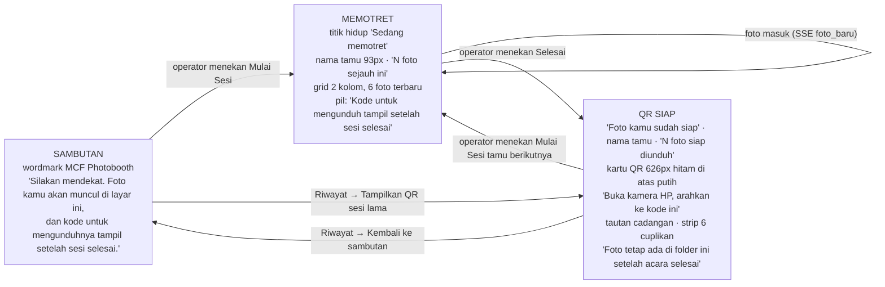

Detail yang dialami tamu di tiap keadaan:

**Sambutan.** Tidak ada nama, tidak ada foto siapa pun. Tamu tahu apa yang akan terjadi
sebelum sesi mulai.

**Memotret.** Begitu operator menekan Mulai Sesi, nama tamu muncul besar. Tiap jepretan
muncul di grid dalam beberapa detik (jeda = tulis berkas oleh Imaging Edge + 1,5 detik
cek stabil + salin + thumbnail), dengan satu gerak masuk 200 ms. Grid hanya menampilkan
enam foto terbaru supaya layar tidak pernah perlu digulir. Angka "N foto sejauh ini"
adalah jumlah foto yang **masuk**, bukan yang sudah di Drive. Pil di bawah grid menjawab
pertanyaan yang pasti ditanyakan tamu, "kodenya mana?", sebelum ditanyakan.

**QR siap.** Nama dan jumlah foto menegaskan ini memang fotonya (sekaligus menangkap
operator yang membuka sesi keliru). Kartu QR selebar 58 % layar, sekitar 17 cm di panel 24
inci, terbaca kamera HP dari dua meter. Tautan cadangan ditulis dalam huruf mono kalau
kamera HP tidak mau memindai. QR **bertahan** sampai operator memulai sesi berikutnya;
tidak ada hitung mundur. Konsekuensinya: tamu berikutnya bisa melihat QR tamu sebelumnya
selama beberapa detik sebelum layar berganti.

Nama panjang mengecil sendiri di atas 16 karakter dan lagi di atas 26 supaya QR tidak
terdorong keluar layar. Layar meminta Wake Lock supaya tidak tidur sepanjang acara.
Di pojok bawah ada baris status kecil "tersambung" / "menyambung ulang…" yang hanya
berguna untuk operator yang melirik.

### 7.2 Di HP: memindai sampai mengunduh

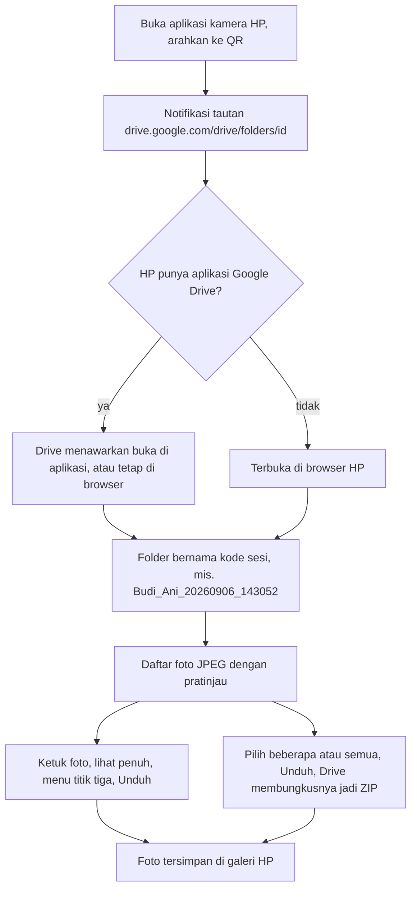

Yang perlu diketahui soal pengalaman ini, karena ia terjadi di antarmuka Google, bukan
antarmuka kita:

- **Tidak perlu login.** Izin folder *anyone with link — reader*. Google mungkin tetap
  menampilkan tombol masuk; itu boleh diabaikan.
- **Tamu hanya bisa melihat dan mengunduh.** Tidak bisa menghapus, mengganti nama, atau
  mengunggah. Izin `reader`, bukan `writer`.
- **Folder ini hanya berisi foto tamu itu.** Tamu tidak bisa naik ke folder induk
  `2. Result/` untuk melihat tamu lain: tautan hanya memberi akses ke satu folder, dan
  folder induk tidak dibagikan.
- **Foto yang masih antre menyusul.** Kalau tamu memindai saat masih ada `pending`, ia
  melihat folder apa adanya saat itu. Kalau ia membuka tautan yang sama lagi nanti, foto
  yang menyusul sudah ada. Ini alasan dialog berisiko di sisi operator ada.
- **Tautannya permanen.** Foto tetap di Drive setelah acara. Kalimat terakhir di layar QR
  menyarankan tamu menyimpan tautannya.
- **Kuota internet tamu.** JPEG 24 MP sekitar 12 MB per foto; ZIP 15 foto sekitar 180 MB.

### 7.3 Yang sengaja tidak dilihat tamu

- **Status upload.** Angka antre dan gagal tidak pernah tampil di monitor tamu; tamu yang
  membaca "2 gagal" tidak punya apa pun untuk dilakukan selain cemas.
- **Nama tamu lain.** Halaman `/tamu` tidak punya navigasi, tidak ada tautan ke Riwayat.
- **Sisa sesi sebelumnya.** Grid dikosongkan saat kode sesi berubah, bukan ditumpuk.
- **Tombol keluar.** Satu-satunya jalan kembali ke panel operator adalah tekan-tahan pojok
  kanan bawah dua detik atau tombol Esc di keyboard laptop. Afordansi terbesar di layar
  yang dilihat tamu bukan tombol untuk menghapus benda yang ia datangi.
- **Nama berkas dan kode sesi** hanya tampil sebagai bagian dari tautan cadangan.

### 7.4 Kalau tamu datang lagi keesokan hari

Tamu menyebut namanya ke operator. Operator membuka Riwayat, mengetik nama, menekan
**Tampilkan QR** (kalau tidak ada sesi berjalan) atau **Salin tautan** lalu mengirimnya
lewat pesan. Tidak ada upload ulang; foto sudah di Drive sejak sesi berlangsung.

---

## 8. Peta halaman dan jendela

Semua disajikan server dari `web/` di `http://127.0.0.1:8000/`.

| Rute | Berkas | Jendela | Aliran SSE | Isi |
|---|---|---|---|---|
| `/` atau `/index.html` | `index.html` | operator | `/api/peristiwa` | halaman Sesi: idle, aktif, selesai, dialog konfirmasi |
| `/riwayat.html` | `riwayat.html` | operator | `/api/peristiwa` | cari sesi, Upload sisanya, Salin tautan, Tampilkan QR |
| `/layar-tamu.html` | `layar-tamu.html` | operator | `/api/peristiwa` | cuplikan besar, status jendela tamu, cara memasang, tiga keadaan |
| `/pengaturan.html` | `pengaturan.html` | operator | `/api/peristiwa` | Drive (login/logout/kuota/struktur), kamera & folder, upload, layar tamu |
| `/tamu` | `tamu.html` | **jendela tamu** (540 × 960, F11 di monitor kedua) | `/api/peristiwa-tamu` | sambutan / memotret / QR siap; Wake Lock; jalan keluar tersembunyi |
| `/tamu?cermin=1` | `tamu.html` | iframe di panel operator | `/api/peristiwa` (sengaja, supaya tidak dihitung) | cuplikan hidup, tanpa Wake Lock |
| `/tamu?laptop=1` | `tamu.html` | tab baru di laptop | `/api/peristiwa-tamu` | cadangan kalau monitor kedua tidak ada |
| `/docs` | FastAPI | — | — | dokumentasi endpoint interaktif |

Sidebar dan bilah atas sama di empat halaman operator: chip "Terputus dari server"
(tersembunyi saat sehat), chip layar tamu, dan di halaman Sesi chip "Sesi berjalan" plus
chip ringkasan upload ("Upload lancar" / "3 antre" / "1 gagal").

---

## 9. Antarmuka server

### 9.1 Endpoint REST

| Metode dan rute | Fungsi | Galat yang mungkin |
|---|---|---|
| `POST /api/sessions` | Mulai Sesi, `{"guest_name": "…"}`; kembali 201 seketika, folder Drive dan QR dipasang di latar | 409 `sesi_masih_aktif` (membawa sesi yang menghalangi), 422 nama kosong |
| `GET /api/sessions?q=&limit=&offset=` | Riwayat dan pencarian, terbaru di atas | — |
| `GET /api/sessions/active` | sesi yang belum diakhiri | 404 |
| `GET /api/sessions/ringkasan` | total, hari ini, sesi dengan foto tertinggal | — |
| `GET /api/sessions/nama-serupa?q=` | berapa sesi hari ini memakai slug yang sama | — |
| `POST /api/sessions/bersiap` | batalkan tenggang setelah Selesai (ketikan pertama nama berikutnya) | — |
| `GET /api/sessions/{id}` | satu sesi beserta hitungan foto dan waktu foto terakhir | 404 |
| `GET /api/sessions/{id}/photos` | daftar foto dengan status, nama, nama thumbnail | 404 |
| `GET /api/sessions/{id}/foto-terakhir` | foto terakhir | 404 |
| `POST /api/sessions/{id}/finish` | Selesai; QR dipastikan ada; monitor tamu berganti | 409 `sudah_selesai` (membawa sesinya, tampilan memperlakukannya sebagai sukses) |
| `POST /api/sessions/{id}/drive` | pasang folder Drive + QR ke sesi yang dimulai saat Drive putus, antrekan foto yang menunggu | 503 `drive_tidak_siap` |
| `POST /api/sessions/{id}/retry-failed` | upload ulang semua `failed` dan `pending` yang menggantung | — |
| `POST /api/sessions/{id}/tampilkan-qr` | paksa monitor tamu menampilkan QR sesi lama | 409 kalau ada sesi aktif, 503 kalau tidak punya tautan |
| `DELETE /api/tampilan-tamu/qr` | batalkan paksaan, kembali ke sambutan | — |
| `POST /api/tanpa-sesi/akui` | operator sudah membaca pita foto tanpa sesi | — |
| `POST /api/photos/{id}/retry` | upload ulang satu foto | 409 `sudah_terupload` / `sedang_diupload`, 410 `berkas_hilang` |
| `GET /api/thumb/{kode}/{nama}` | thumbnail JPEG 400px; nama asli `.JPG` juga diterima | 404; path traversal ditolak |
| `GET /api/qr/{kode}` | PNG QR; dibuat ulang dari tautan di DB kalau berkasnya hilang | 404 |
| `GET /api/preflight` | enam pemeriksaan, `boleh_mulai`, alasan/peringatan, statistik watcher, keadaan layar tamu | — |
| `GET /api/pengaturan` | konfigurasi yang berlaku, hanya baca | — |
| `GET /api/drive/status?paksa=` | keadaan Drive: `terhubung` / `belum_login` / `token_kedaluwarsa` / `tanpa_credentials` / `offline` / `galat` | — |
| `POST /api/drive/login` · `GET /api/drive/login` | mulai OAuth di thread latar; pantau hasilnya | — |
| `POST /api/drive/logout` | hapus `token.json` dan lupakan ID folder | — |
| `GET /api/tampilan-tamu` | keadaan monitor tamu (§5.3) | — |
| `GET /api/peristiwa` · `GET /api/peristiwa-tamu` | Server-Sent Events | — |

Semua metode selain GET/HEAD/OPTIONS ditolak 403 kalau `Origin` tidak cocok dengan `Host`
atau `Sec-Fetch-Site: cross-site`. Aplikasi tidak punya login, jadi ini satu-satunya pagar
terhadap halaman web lain di laptop yang sama.

### 9.2 Peristiwa SSE

Pesan pertama di tiap koneksi bernama `halo` dan membawa keadaan lengkap (sesi aktif,
tampilan tamu, apakah layar tamu terhubung). Setelah itu server mengirim `{"jenis":"ping"}`
tiap 25 detik kalau sepi; klien menganggap sambungan mati kalau sunyi 45 detik.

| Jenis | Ke operator | Ke tamu | Kapan |
|---|---|---|---|
| `sesi_mulai` | ✓ | ✓ | Mulai Sesi |
| `sesi_drive_terpasang` | ✓ | ✓ | folder Drive + QR selesai dipasang di latar |
| `sesi_selesai` | ✓ | ✓ | Selesai |
| `foto_baru` | ✓ (dengan data foto) | ✓ (hanya id sesi) | berkas tercatat `pending` |
| `foto_uploaded` | ✓ (dengan data foto) | ✓ (hanya id sesi) | upload sukses |
| `foto_gagal` | ✓ | — | 4 percobaan habis |
| `foto_retry` | ✓ | — | foto dikembalikan ke `pending` untuk diulang |
| `foto_menunggu_drive` | ✓ | — | sesi belum punya folder Drive |
| `foto_dilewati` | ✓ | — | berkas tidak stabil atau gagal diproses |
| `foto_tanpa_sesi` | ✓ | — | berkas diamankan ke `_tanpa_sesi/` |
| `tampilan_tamu` | ✓ | ✓ | Tampilkan QR / Kembali ke sambutan dari Riwayat |
| `layar_tamu` | ✓ | — | jendela tamu tersambung atau putus |
| `drive_status` | ✓ | — | login selesai atau logout |

Jendela tamu tidak membedakan jenisnya: apa pun yang datang selain `halo` dan `layar_tamu`
memicu pemanggilan ulang `/api/tampilan-tamu`. Jendela operator memakai isi peristiwa
untuk memperbarui grid tanpa memuat ulang, dan memanggil ulang preflight pada peristiwa
sesi/drive/layar tamu.

---

## 10. Penyimpanan

### 10.1 SQLite (`sessions.db`, mode WAL)

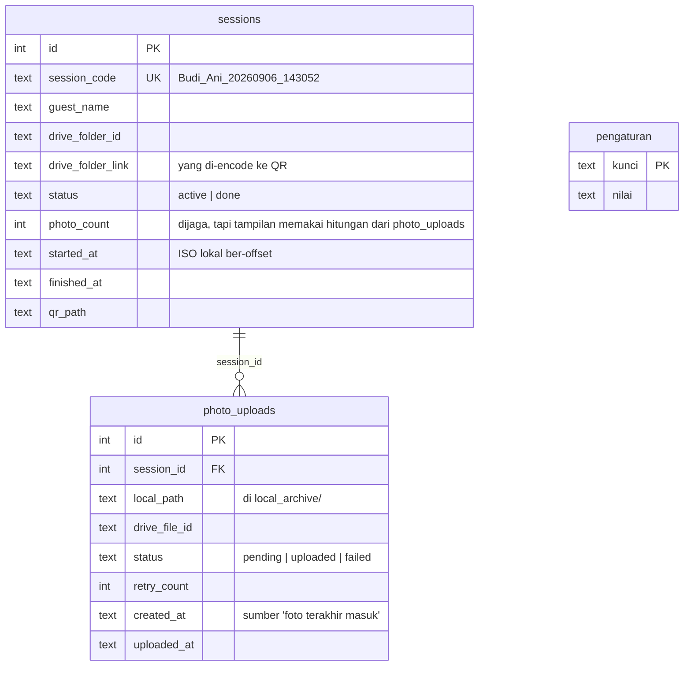

Isi `pengaturan`: `drive_root_id`, `drive_qr_id`, `drive_result_id`, `drive_induk_sumber`
(ID folder yang dibuat aplikasi di Drive), `tampilkan_qr_sesi_id` dan `paksa_sambutan`
(kendali monitor tamu dari Riwayat), `tanpa_sesi_diakui_at` (batas pita kuning).

Koneksi berumur pendek per operasi; WAL membuat thread watcher menulis tanpa mengunci
pembacaan operator. `lower()` diganti fungsi Python supaya "élan" menemukan "Élan".

### 10.2 Folder di laptop

```
<akar repo>/
├── tether_dropbox/            diisi Imaging Edge; dipantau rekursif; TIDAK PERNAH dihapus aplikasi
├── local_archive/
│   ├── <kode_sesi>/           salinan permanen per sesi (lapis backup 2) — IMG_0041.JPG, IMG_0041_2.JPG
│   └── _tanpa_sesi/           jepretan saat tidak ada sesi; dipindahkan manual
├── thumbs/<kode_sesi>/*.jpg   400px sisi panjang, dipakai grid operator dan monitor tamu
├── qr_codes/<kode_sesi>.png   dibuat ulang otomatis kalau hilang
├── sessions.db (+ -wal, -shm)
├── .env                       konfigurasi
├── credentials.json           OAuth client Desktop app — jangan masuk repo
└── token.json                 ditulis tombol Login Google — jangan masuk repo
```

Semua tulis ke arsip dan thumbnail lewat berkas sementara (`.part`, `.tmp`) lalu
`os.replace`, supaya crash di tengah salinan tidak meninggalkan berkas terpotong bernama
asli.

### 10.3 Folder di Google Drive

```
MCF Photobooth/                  dibuat aplikasi di akar Drive (scope drive.file tidak melihat folder buatan tangan)
├── 1. QR/                       salinan PNG QR tiap sesi — cadangan kalau laptop rusak
└── 2. Result/
    └── <kode_sesi>/             satu folder per tamu, izin anyone-with-link reader; inilah tujuan QR
        ├── IMG_0041.JPG
        └── IMG_0042.JPG
```

ID ketiga folder diingat di tabel `pengaturan` supaya Mulai Sesi tidak perlu `files.list`.
Logout melupakannya; login berikutnya mencari folder bernama sama sebelum membuat baru.

---

## 11. Keandalan

### 11.1 Tiga lapis backup

| Lapis | Tempat | Bertahan dari |
|---|---|---|
| 1 | kartu SD kamera | tethering atau laptop mati |
| 2 | `local_archive/` | internet venue mati |
| 3 | Google Drive | laptop rusak setelah acara |

Tidak ada tombol hapus arsip di aplikasi. Satu klik yang salah lebih mahal daripada
membersihkan lewat Explorer.

### 11.2 Mekanisme yang bekerja di latar

| Mekanisme | Kapan | Yang dijamin |
|---|---|---|
| Retry upload 1, 5, 15 detik | tiap foto | gangguan sesaat tidak menghasilkan `failed` |
| `cek_dulu` pada retry | tiap percobaan ulang | respons yang hilang di jaringan tidak menghasilkan berkas ganda di Drive |
| Kunci per sesi di `pasang_drive` | upload paralel untuk sesi tanpa folder | folder Drive dibuat tepat sekali walau 3 pekerja memanggil bersamaan |
| Penjaga latar tiap 30 detik | selalu | foto `failed`/`pending` diulang begitu Drive terjangkau; sesi tanpa folder dipasangi; berkas tether yang terlewat disapu selama ada sesi aktif |
| `pulihkan()` saat server naik | sekali | `pending` yang terpotong restart diantrekan lagi; berkas tether yang lebih baru dari awal sesi aktif diproses |
| Batas waktu semua panggilan Drive (20 detik) dan refresh token | selalu | wifi setengah mati tidak membekukan preflight atau pool upload |
| `BEGIN IMMEDIATE` di buat/akhiri sesi | klik ganda | tidak pernah dua sesi aktif; `finished_at` tidak ditimpa |
| Tenggang 45 detik setelah Selesai, batal saat nama berikutnya diketik | jepretan susulan | foto terakhir ikut folder yang benar; jepretan uji tamu baru tidak nyasar ke tamu lama |
| Batas waktu berkas tether (`_batas_waktu_tether`) | restart di tengah acara | ratusan foto lama di `tether_dropbox/` tidak menempel ke sesi baru |
| Antrean SSE 500 pesan, buang yang terlama | tab dibekukan browser | satu pelanggan macet tidak menahan yang lain |
| Deteksi sunyi 45 detik di klien | server mati diam-diam | angka basi ditandai, aksi pengubah keadaan dimatikan |

---

## 12. Keamanan dan privasi

- **Scope OAuth `drive.file`.** Aplikasi hanya melihat folder dan berkas yang dibuatnya.
  Akun Drive operator selebihnya tidak tersentuh, dan token yang bocor pun tidak bisa
  membaca Drive lain.
- **Izin folder sesi `reader`.** Tamu tidak bisa menghapus atau mengubah.
- **Tautan hanya tersebar lewat QR fisik** ke tamu yang bersangkutan. ID folder Drive
  acak dan tidak terindeks mesin pencari (risiko dicatat di PRD §12).
- **Server hanya di `127.0.0.1`.** Tidak ada port terbuka ke jaringan venue atau internet.
  Windows Firewall tidak bertanya apa-apa.
- **Tanpa login, jadi Origin adalah pagarnya.** POST/DELETE lintas situs ditolak 403.
- **Path traversal ditolak** di `/api/thumb` dan `/api/qr`: bagian path yang mengandung
  `/`, `\`, atau NUL, dan hasil resolve yang keluar dari folder dasar, dijawab 404.
- **Kredensial tidak pernah masuk repo.** `.gitignore` menutup `credentials.json`,
  `token.json`, `.env`, `sessions.db`, dan semua berkas foto. `token.json` ditulis dengan
  mode `0600`.
- **Login hanya lewat tombol.** Tidak ada permintaan ke Drive yang tiba-tiba membuka
  browser di tengah sesi.

---

## 13. Konfigurasi (`.env`)

Semua opsional; path relatif dihitung dari akar repo.

| Variabel | Bawaan | Arti |
|---|---|---|
| `CAMERA_MODEL`, `TETHERING_APP` | Sony ZV-E10, Imaging Edge Desktop | label di Pengaturan dan log |
| `TETHER_DROPBOX`, `LOCAL_ARCHIVE`, `THUMBS`, `QR_CODES`, `MCF_DB` | di akar repo | lokasi folder kerja dan database |
| `DRIVE_PARENT_FOLDER_ID` | kosong | hanya berguna kalau ID itu folder buatan aplikasi ini; kalau ditolak, aplikasi memakai induknya sendiri |
| `DRIVE_ROOT_NAME`, `DRIVE_FOLDER_QR`, `DRIVE_FOLDER_RESULT` | MCF Photobooth, 1. QR, 2. Result | nama struktur di Drive |
| `GOOGLE_CREDENTIALS`, `GOOGLE_TOKEN` | `./credentials.json`, `./token.json` | lokasi kredensial |
| `STABILITAS_DETIK` | 1,5 | berkas dianggap selesai ditulis kalau ukurannya tidak berubah selama ini |
| `STABIL_TIMEOUT` | 45 | batas menunggu stabil sebelum dilewati (penjaga mencoba lagi) |
| `TENGGANG_SETELAH_SELESAI` | 45 | jepretan setelah Selesai masih milik sesi itu |
| `PENJAGA_DETIK` | 30 | interval penjaga latar |
| `UPLOAD_PARALEL` | 3 | jumlah pekerja upload |
| `DRIVE_HTTP_TIMEOUT`, `DRIVE_LOGIN_TIMEOUT` | 20, 240 | batas waktu panggilan Drive dan menunggu login di browser |
| `MCF_IZINKAN_TANPA_DRIVE` | 0 | 1 = Mulai Sesi hidup walau belum login (pengembangan saja) |
| `MCF_DRIVE_PALSU` | 0 | 1 = Drive digantikan tiruan dalam memori (uji otomatis) |

---

## 14. Tech stack

| Bagian | Pilihan | Alasan singkat |
|---|---|---|
| OS produksi | Windows | Imaging Edge Desktop dan digiCamControl hanya ada di sana; kode berjalan di macOS untuk pengembangan |
| Tethering | Imaging Edge Desktop (Sony); cadangan digiCamControl, qDslrDashboard | menulis berkas ke folder, itu satu-satunya kontrak yang dibutuhkan watcher |
| Backend | Python 3.11+, FastAPI, uvicorn, sse-starlette | ringan, satu proses, dokumentasi endpoint gratis di `/docs` |
| Pemantau folder | watchdog | `on_created` dan `on_moved`, rekursif |
| Database | SQLite (WAL) | satu berkas, bisa dibawa pindah laptop |
| Drive | google-api-python-client, google-auth-oauthlib | upload resumable 4 MB, scope `drive.file` |
| QR | qrcode (Pillow) | error correction H, box 12, border 4 |
| Thumbnail | Pillow | EXIF transpose, 400px, JPEG q85; ARW dilewati |
| Frontend | HTML/CSS/JS polos, tanpa build, tanpa CDN; font Hanken Grotesk dan JetBrains Mono di-bundle | wajib jalan saat wifi venue mati |
| Tema | gelap seluruhnya (`web/ui.css`) | layar besar di ballroom remang tidak menyilaukan |

---

## 15. Pengujian

Tiga skrip di `uji/`, masing-masing menjalankan server sungguhan di subprocess dengan
folder kerja sementara, jadi tidak menyentuh data milik operator.

| Skrip | Cakupan | Drive |
|---|---|---|
| `uji_langkah1.py` | sesi, kode sesi, satu sesi aktif, pencarian Riwayat | tidak disentuh |
| `uji_v1.py` | watcher, arsip, thumbnail, SSE, layar tamu, riwayat, pemulihan setelah restart; semua foto berhenti di `pending` | tidak disentuh |
| `uji_drive_palsu.py` | folder per sesi, upload dan retry, QR sungguhan di layar tamu, balapan saat Drive pulih (saklar `drive-palsu-mati`), penjaga latar, restart di tengah sesi | tiruan dalam memori (`MCF_DRIVE_PALSU=1`) |

`simulasi/` berisi kerangka folder kerja dan dua JPEG gradien 14 KB yang dipakai skrip
uji. Yang **belum** pernah diuji dan harus dicoba sebelum acara pertama: akun Drive
sungguhan dan kamera sungguhan (cara Imaging Edge menulis berkas: langsung atau lewat
nama sementara lalu rename; keduanya ditangani).

---

## 16. Batasan v1 dan kandidat v2

Sengaja tidak ada di v1: galeri kustom dengan unduh ZIP dan branding (tamu masih melihat
antarmuka Drive), dukungan Mac untuk tethering, multi-kamera atau multi-station, deteksi
otomatis "sesi selesai", pencetakan, pembayaran, tombol hapus arsip, login aplikasi, dan
tema terang.

Kandidat v2 yang tidak mengubah arsitektur ini:

- **Galeri kustom** menggantikan tautan Drive mentah. Karena `qr.py` hanya menerima
  string, cukup ganti sumber tautan di `pasang_drive`.
- **Peringatan "tidak ada foto baru N menit"** ke operator, tetap tanpa menutup sesi
  otomatis.
- **Memindahkan foto `_tanpa_sesi/` ke sesi** lewat aplikasi, bukan Explorer.
- **Ekspor Riwayat** ke CSV/Excel untuk rekap acara.
- **Tema terang** sebagai blok `:root` alternatif di `web/ui.css` untuk venue terang.
