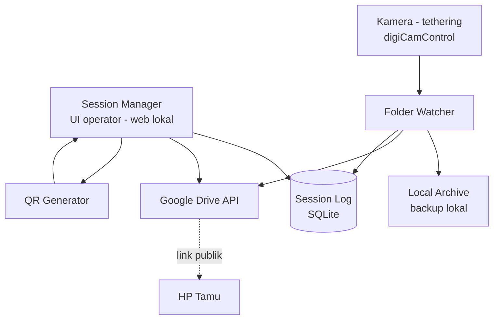

# Arsitektur Sistem Photobooth Otomatis

## 1. Ringkasan

Sistem ini menghubungkan kamera DSLR/mirrorless (dioperasikan manual oleh operator) ke Google Drive secara otomatis, lalu memberi tamu akses download lewat QR code. Operator memasukkan nama tamu sebelum sesi mulai, sistem langsung menyiapkan folder dan link — bukan setelah foto selesai — sehingga QR bisa digenerate ulang kapan pun tanpa kehilangan data.

Platform: **Windows**, berbasis lokal (laptop di venue), storage & akses tamu lewat **Google Drive**.

## 2. Prinsip Desain

- **Operator selalu punya kontrol penuh** — dua konfirmasi manual: mulai sesi, selesai sesi. Tidak ada yang terjadi otomatis di luar itu.
- **QR baru muncul setelah operator konfirmasi selesai**, meski folder & link sudah dibuat sejak awal sesi.
- **Tidak ada file yang hilang** kalau koneksi internet venue putus — retry otomatis, tidak ada penghapusan sebelum upload terkonfirmasi.
- **Laptop tidak perlu diekspos ke internet.** Tamu mengakses Drive langsung dari HP mereka, bukan lewat laptop operator.
- **Session bisa ditelusuri ulang** kapan saja lewat nama tamu, walau aplikasi sempat ditutup atau QR fisik hilang.

## 3. Komponen Sistem

Empat komponen independen, saling terhubung lewat database lokal — bukan lewat state di memory — supaya tidak ada yang hilang kalau salah satu bagian di-restart.



### 3.1 Session Manager (UI Operator)

Aplikasi web lokal (server jalan di laptop operator, dibuka lewat browser mode kiosk/fullscreen) dengan 3 tahap tampilan:

1. **Idle** — form input nama tamu + tombol "Mulai Sesi"
2. **Aktif** — status "Sesi aktif, silakan motret", menampilkan jumlah foto yang sudah masuk & status upload (terkirim / masih pending), tombol besar "Selesai"
3. **Selesai** — QR code ditampilkan penuh layar + instruksi untuk tamu

Saat "Mulai Sesi" ditekan: sistem generate `session_code` (nama tamu + timestamp), buat folder di Drive, simpan record baru di database dengan status `active`. Saat "Selesai" ditekan: status diubah jadi `done`, QR di-generate dari link yang sudah ada sejak awal, dan ditampilkan.

**Kenapa web app, bukan aplikasi desktop biasa:** lebih gampang di-styling supaya enak dilihat tamu, gampang dipisah jadi 2 tampilan (layar operator vs layar tamu) kalau nanti pakai monitor kedua, dan lebih gampang di-upgrade ke gallery page custom nanti.

### 3.2 Folder Watcher (Auto-Upload)

Proses background yang memantau folder tempat digiCamControl menaruh hasil jepretan (`tether_dropbox/`). Untuk tiap file baru:

1. Tunggu file selesai ditulis (cek ukuran file stabil)
2. Salin ke `local_archive/<session_code>/` — **file ini tidak dihapus**, jadi ini backup kedua
3. Upload ke folder Drive milik sesi yang sedang `active`
4. Catat hasilnya (sukses/gagal) ke tabel `photo_uploads`
5. Kalau gagal, retry otomatis dengan jeda bertambah (1x, 5x, 15x detik) — kalau tetap gagal setelah beberapa kali, ditandai `failed` dan ditampilkan di UI operator supaya bisa di-retry manual sebelum sesi ditutup

### 3.3 Session Log (SQLite)

Satu file database lokal (`sessions.db`) — tidak butuh server database terpisah. Ini yang membuat sesi bisa ditelusuri ulang kapan saja, dan yang membuat sistem tahan kalau aplikasi crash di tengah jalan.

**Tabel `sessions`**

| Kolom | Tipe | Keterangan |
|---|---|---|
| id | INTEGER PK | |
| session_code | TEXT UNIQUE | contoh: `Budi_Ani_20260809_143052` — timestamp sampai **detik**, lihat catatan di bawah |
| guest_name | TEXT | nama yang diinput operator |
| drive_folder_id | TEXT | ID folder di Drive |
| drive_folder_link | TEXT | link yang di-encode ke QR |
| status | TEXT | `active` / `done` |
| photo_count | INTEGER | jumlah foto masuk |
| started_at | TEXT | timestamp mulai |
| finished_at | TEXT | timestamp selesai |
| qr_path | TEXT | path file gambar QR lokal |

**Tabel `photo_uploads`**

| Kolom | Tipe | Keterangan |
|---|---|---|
| id | INTEGER PK | |
| session_id | INTEGER FK | relasi ke `sessions` |
| local_path | TEXT | path di `local_archive/` |
| drive_file_id | TEXT | ID file di Drive setelah terupload |
| status | TEXT | `pending` / `uploaded` / `failed` |
| retry_count | INTEGER | |
| created_at | TEXT | |
| uploaded_at | TEXT | |

**Kenapa `session_code` presisi detik.** Kode ini sekaligus jadi nama folder di `local_archive/` dan di Drive (§5), dan kolomnya UNIQUE. Dengan presisi menit, dua tamu bernama sama yang mulai dalam menit yang sama menghasilkan kode identik: INSERT-nya ditolak dan sesi kedua gagal dibuat — atau, kalau constraint-nya dilonggarkan, keduanya menulis ke folder yang sama dan QR tamu pertama menampilkan foto tamu kedua. Sesi photobooth berlangsung beruntun, jadi jarak antar-sesi diukur dalam detik, bukan menit. Implementasi di `prototipe/app.js` (`kodeSesi()`) sudah mengikuti format ini.

**Fitur "cari sesi yang hilang":** operator cari nama tamu di tabel `sessions`, ambil `drive_folder_link`, generate ulang QR dari link itu — tidak perlu upload ulang apa pun karena foto sudah ada di Drive.

### 3.4 QR Generator

Modul kecil dan sengaja dibuat sesederhana mungkin: terima 1 string link, keluarkan 1 file gambar QR. Karena input-nya cuma "link", nanti kalau mau ganti dari link Drive mentah ke gallery page custom, cukup ganti sumber link-nya di Session Manager — modul ini sendiri tidak perlu disentuh.

## 4. Alur Data End-to-End

1. Operator input nama tamu → klik **Mulai Sesi**
2. Sistem buat `session_code`, buat folder di Drive, set permission folder jadi *anyone with link = viewer*, simpan ke `sessions` (status `active`)
3. Operator motret manual pakai kamera — tiap jepretan otomatis turun ke `tether_dropbox/` lewat digiCamControl
4. Folder Watcher mendeteksi file baru → salin ke local archive → upload ke folder Drive sesi aktif → catat ke `photo_uploads`
5. UI menampilkan progres upload real-time (jumlah foto masuk, status pending/terkirim)
6. Operator klik **Selesai** setelah yakin semua foto sudah masuk → status sesi jadi `done`
7. QR di-generate dari `drive_folder_link` → ditampilkan penuh layar
8. Tamu scan QR pakai HP → browser HP connect langsung ke Google Drive (tidak lewat laptop) → download foto

## 5. Struktur Folder Lokal

```
photobooth/
├── app/
│   ├── server.py          # web server + routing UI
│   ├── drive_client.py    # auth & upload ke Google Drive
│   ├── db.py               # akses SQLite
│   ├── watcher.py          # pemantau folder tethering
│   └── qr.py                # generate QR dari link
├── tether_dropbox/         # folder output digiCamControl
├── local_archive/           # backup foto per sesi, permanen
├── qr_codes/
├── sessions.db
├── credentials.json         # OAuth client dari Google Cloud Console
└── token.json                # dibuat otomatis setelah login pertama
```

## 6. Reliability — 3 Lapis Backup

| Lapis | Lokasi | Bertahan dari |
|---|---|---|
| 1 | Kartu SD kamera | Kegagalan tethering/laptop |
| 2 | `local_archive/` di laptop | Kegagalan koneksi internet |
| 3 | Google Drive | Kegagalan laptop/hardware setelah sesi |

Selama satu lapis gagal, dua lapis lain tetap menjaga foto tidak hilang.

## 7. Keamanan

- OAuth scope dibatasi ke `drive.file` — aplikasi cuma bisa akses file/folder yang dibuatnya sendiri, bukan seluruh Drive akun.
- Permission folder sesi diset **viewer only** (bukan editor), jadi tamu tidak bisa menghapus atau mengubah foto orang lain.
- Laptop tidak membuka port apa pun ke internet publik — web server hanya diakses lokal (`localhost`) oleh operator.

## 8. Tech Stack

| Bagian | Pilihan |
|---|---|
| OS | Windows |
| Tethering kamera | digiCamControl |
| Backend | Python (FastAPI/Flask) |
| Frontend | HTML/CSS/JS, dibuka di browser mode kiosk |
| Database | SQLite |
| Storage | Google Drive API (OAuth, scope `drive.file`) |
| QR | library `qrcode` |
| Folder watcher | library `watchdog` |

## 9. Pengembangan Lanjutan (v2, opsional)

- **Gallery page custom** menggantikan link Drive mentah — tampilan lebih branded, ada tombol "download semua sebagai ZIP". Cukup ganti sumber link di QR Generator.
- **Layar terpisah** untuk operator vs tamu (dua window/tab dari web app yang sama).
- **Auto-detect selesai** — kalau tidak ada foto baru masuk selama beberapa menit, beri notifikasi ke operator (bukan otomatis menutup sesi, tetap perlu konfirmasi manual sesuai prinsip desain).
- **Export log harian** — tabel `sessions` di-export ke Excel/CSV untuk rekap event.
